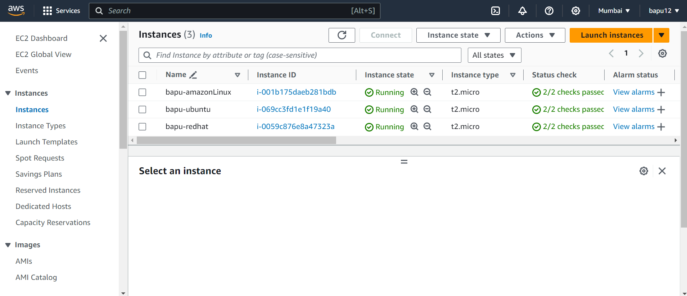
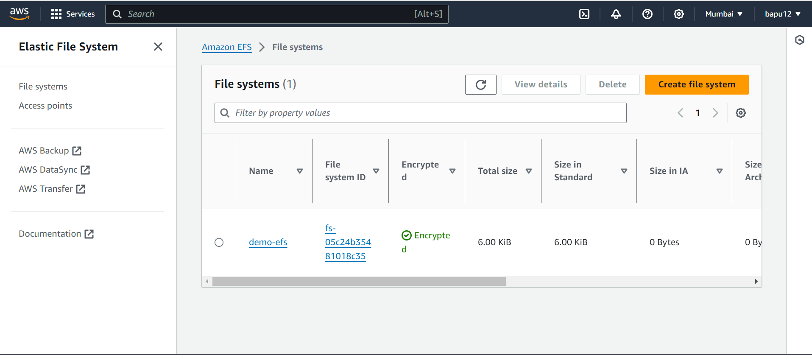
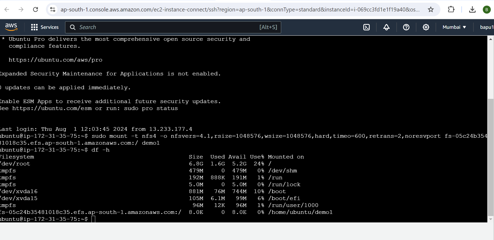
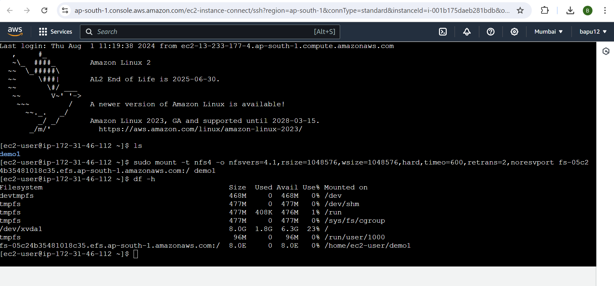

# EFS-EC2-Project

This project demonstrates how to create an EFS and connect it to three different EC2 instances running different operating systems: Ubuntu, Red Hat Linux, and Amazon Linux 2.

## Table of Contents
- [Introduction](#introduction)
- [Setup Instructions](#setup-instructions)
- [Instance Configurations](#instance-configurations)
- [Screenshots](#screenshots)
- [Conclusion](#conclusion)

## Introduction
The goal of this project is to maintain the security of the AWS account and resources by recognizing and monitoring different users and their EC2 instances for errors or misconfigurations.

## Setup Instructions
Detailed instructions on how to set up the EFS and EC2 instances can be found in the [setup-instructions.md](docs/setup-instructions.md) file.

## Instance Configurations
Information about the configurations of the EC2 instances can be found in the [instance-configurations.md](docs/instance-configurations.md) file.

## Screenshots
Below are the screenshots of the solution:
- **EC2 Instance**:
  
- **EFS Creation**:
  
- **EFS Mount With Ubuntu Instance**:
  
- **EFS Mount With Amazon Linux 2 Instance**:
  
- **EFS Mount With Red Hat Linux Instance**:
  

## Conclusion
This project showcases the ability to set up and manage AWS resources effectively, ensuring secure and efficient operations across different operating systems.
